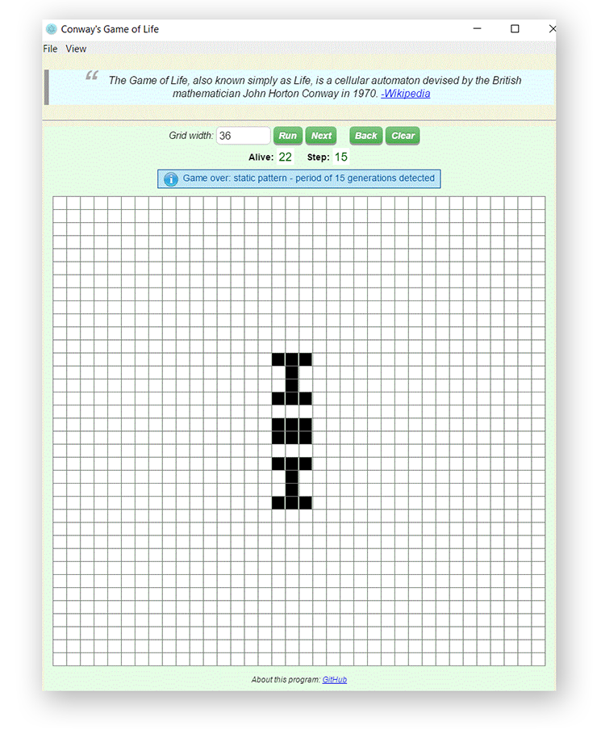

# electron-game-of-life
Conway's Game of Life using Electron framework

This is a simple application showing various aspects of writing 
desktop apps using Electron/HTML5/CSS/NodeJS/Javascript.

###Screen capture:

## Motivation
I wrote this as an exercise inspired by an excellent tutorial by Lea Verou [Play by Play](https://www.pluralsight.com/courses/play-by-play-lea-verou).

## Features
* Auto-run or step-by-step
* Back step history (up to 1000 steps)
* Auto detection of still life and oscilllators
* Change grid size at any time
* Save and load grid configuration (JSON text format)
* Works on Windows, OSX and Linux

## Install and Run
This is a very basic Electron application. 
So, just run it by `electron .` or `npm start`

If you are new to Electron, please read [Quick Start](https://github.com/electron/electron/blob/master/docs/tutorial/quick-start.md)

## Distribution
To package the app into a stand-alone for a distribution, I used [electron-packager](https://github.com/electron-userland/electron-packager)

### For Windows
In CMD, set `cd <my app folder>` 
Note: First, I needed to install electron to my app folder. Like this: `npm install electron`
Then:
`electron-packager . --platform=win32 --arch=x64`

It should create `game-of-life-win32-x64` folder containing game distribution i.e: 
game-of-life.exe together with dll's and resources to run app as a stand-alone.

## License

[MIT](LICENSE)